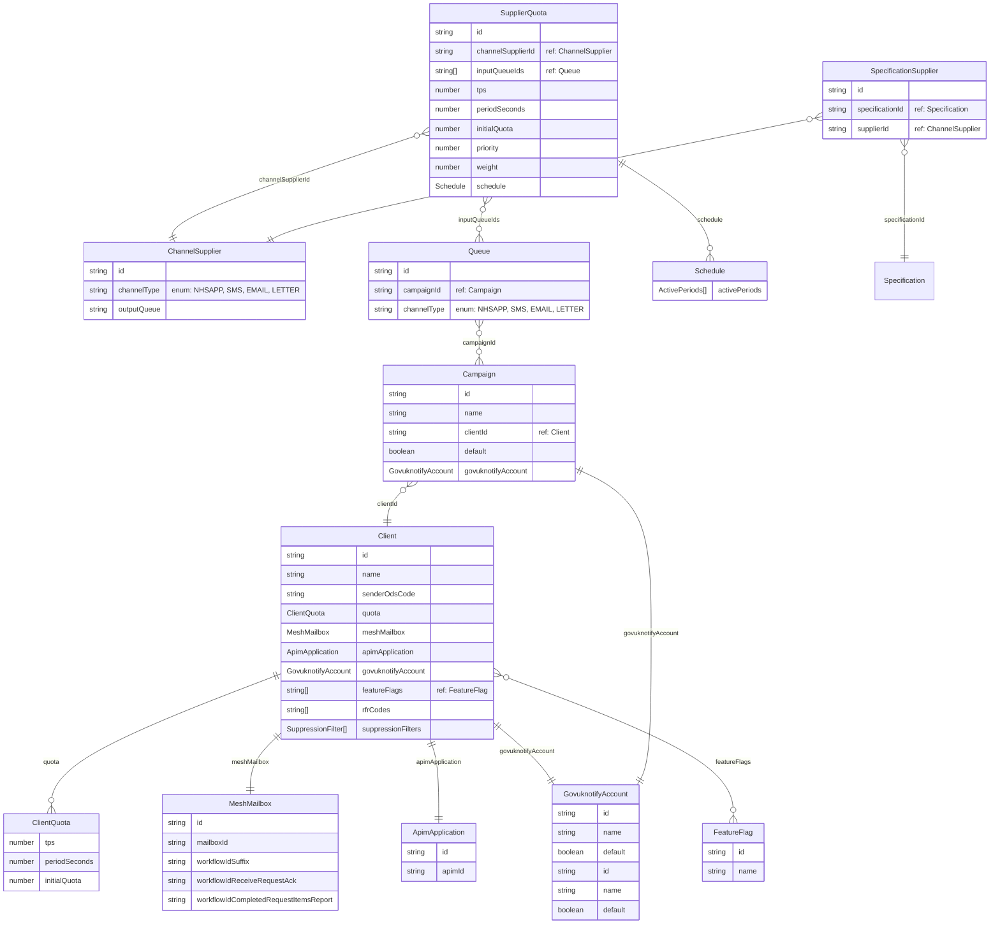

# Client Config Domain Model Entities

```mermaid
erDiagram
    FeatureFlag {
        string id
        string name
    }
    Client {
        string id
        string name
        string senderOdsCode
        ClientQuota quota
        MeshMailbox meshMailbox
        ApimApplication apimApplication
        GovuknotifyAccount govuknotifyAccount
        string[] featureFlags "ref: FeatureFlag"
        string[] rfrCodes
        SuppressionFilter[] suppressionFilters
    }
    ClientQuota {
        number tps
        number periodSeconds
        number initialQuota
    }
    MeshMailbox {
        string id
        string mailboxId
        string workflowIdSuffix
        string workflowIdReceiveRequestAck
        string workflowIdCompletedRequestItemsReport
    }
    ApimApplication {
        string id
        string apimId
    }
    GovuknotifyAccount {
        string id
        string name
        boolean default
    }
    FeatureFlag {
    }
    Campaign {
        string id
        string name
        string clientId "ref: Client"
        boolean default
        GovuknotifyAccount govuknotifyAccount
    }
    GovuknotifyAccount {
        string id
        string name
        boolean default
    }
    Client {
    }
    ChannelSupplier {
        string id
        string channelType "enum: NHSAPP, SMS, EMAIL, LETTER"
        string outputQueue
    }
    Queue {
        string id
        string campaignId "ref: Campaign"
        string channelType "enum: NHSAPP, SMS, EMAIL, LETTER"
    }
    Campaign {
    }
    SupplierQuota {
        string id
        string channelSupplierId "ref: ChannelSupplier"
        string[] inputQueueIds "ref: Queue"
        number tps
        number periodSeconds
        number initialQuota
        number priority
        number weight
        Schedule schedule
    }
    Schedule {
        ActivePeriods[] activePeriods
    }
    ChannelSupplier {
    }
    Queue {
    }
    SpecificationSupplier {
        string id
        string specificationId "ref: Specification"
        string supplierId "ref: ChannelSupplier"
    }
    Specification {
    }
    ChannelSupplier {
    }
    Client ||--o{ ClientQuota : "quota"
    Client ||--|| MeshMailbox : "meshMailbox"
    Client ||--|| ApimApplication : "apimApplication"
    Client ||--|| GovuknotifyAccount : "govuknotifyAccount"
    Client }o--o{ FeatureFlag : "featureFlags"
    Campaign }o--|| Client : "clientId"
    Campaign ||--|| GovuknotifyAccount : "govuknotifyAccount"
    Queue }o--o{ Campaign : "campaignId"
    SupplierQuota }o--|| ChannelSupplier : "channelSupplierId"
    SupplierQuota }o--o{ Queue : "inputQueueIds"
    SupplierQuota ||--o{ Schedule : "schedule"
    SpecificationSupplier }o--|| Specification : "specificationId"
    SpecificationSupplier }o--|| ChannelSupplier : "supplierId"
```
