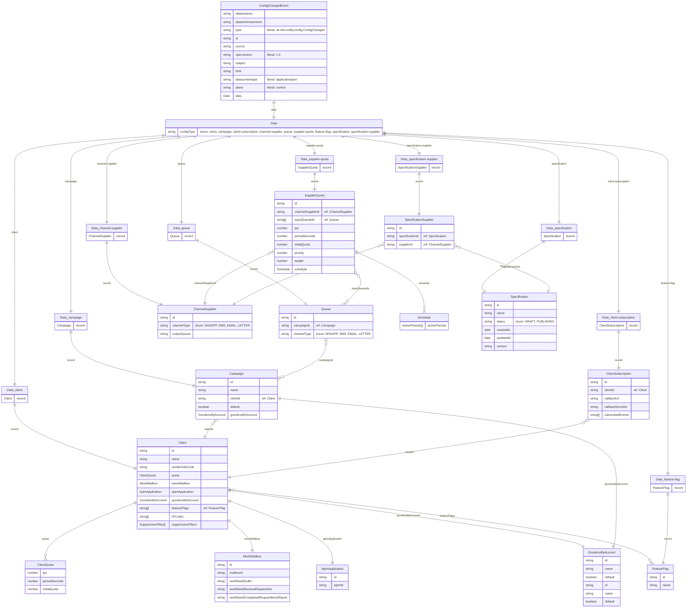

# config-changed-1.0.0 event schema

```mermaid
erDiagram
    ConfigChangedEvent {
        string dataschema
        string dataschemaversion
        string type "literal: uk.nhs.notify.config.ConfigChanged"
        string id
        string source
        string specversion "literal: 1.0"
        string subject
        string time
        string datacontenttype "literal: application/json"
        string plane "literal: control"
        Data data
    }
    Data {
        string configType "enum: client, campaign, client-subscription, channel-supplier, queue, supplier-quota, feature-flag, specification, specification-supplier"
    }
    Data_client {
        Client record
    }
    Client {
        string id
        string name
        string senderOdsCode
        ClientQuota quota
        MeshMailbox meshMailbox
        ApimApplication apimApplication
        GovuknotifyAccount govuknotifyAccount
        string[] featureFlags "ref: FeatureFlag"
        string[] rfrCodes
        SuppressionFilter[] suppressionFilters
    }
    ClientQuota {
        number tps
        number periodSeconds
        number initialQuota
    }
    MeshMailbox {
        string id
        string mailboxId
        string workflowIdSuffix
        string workflowIdReceiveRequestAck
        string workflowIdCompletedRequestItemsReport
    }
    ApimApplication {
        string id
        string apimId
    }
    GovuknotifyAccount {
        string id
        string name
        boolean default
    }
    FeatureFlag {
    }
    Data_campaign {
        Campaign record
    }
    Campaign {
        string id
        string name
        string clientId "ref: Client"
        boolean default
        GovuknotifyAccount govuknotifyAccount
    }
    GovuknotifyAccount {
        string id
        string name
        boolean default
    }
    Client {
    }
    Data_client-subscription {
        ClientSubscription record
    }
    ClientSubscription {
        string id
        string clientId "ref: Client"
        string callbackUrl
        string callbackSecretId
        string[] subscribedEvents
    }
    Client {
    }
    Data_channel-supplier {
        ChannelSupplier record
    }
    ChannelSupplier {
        string id
        string channelType "enum: NHSAPP, SMS, EMAIL, LETTER"
        string outputQueue
    }
    Data_queue {
        Queue record
    }
    Queue {
        string id
        string campaignId "ref: Campaign"
        string channelType "enum: NHSAPP, SMS, EMAIL, LETTER"
    }
    Campaign {
    }
    Data_supplier-quota {
        SupplierQuota record
    }
    SupplierQuota {
        string id
        string channelSupplierId "ref: ChannelSupplier"
        string[] inputQueueIds "ref: Queue"
        number tps
        number periodSeconds
        number initialQuota
        number priority
        number weight
        Schedule schedule
    }
    Schedule {
        ActivePeriods[] activePeriods
    }
    ChannelSupplier {
    }
    Queue {
    }
    Data_feature-flag {
        FeatureFlag record
    }
    FeatureFlag {
        string id
        string name
    }
    Data_specification {
        Specification record
    }
    Specification {
        string id
        string name
        string status "enum: DRAFT, PUBLISHED"
        date createdAt
        date updatedAt
        string version
    }
    Data_specification-supplier {
        SpecificationSupplier record
    }
    SpecificationSupplier {
        string id
        string specificationId "ref: Specification"
        string supplierId "ref: ChannelSupplier"
    }
    Specification {
    }
    ChannelSupplier {
    }
    ConfigChangedEvent ||--|| Data : "data"
    Data_client ||--|| Client : "record"
    Client ||--o{ ClientQuota : "quota"
    Client ||--|| MeshMailbox : "meshMailbox"
    Client ||--|| ApimApplication : "apimApplication"
    Client ||--|| GovuknotifyAccount : "govuknotifyAccount"
    Client }o--o{ FeatureFlag : "featureFlags"
    Data_campaign ||--|| Campaign : "record"
    Campaign }o--|| Client : "clientId"
    Campaign ||--|| GovuknotifyAccount : "govuknotifyAccount"
    Data_client-subscription ||--|| ClientSubscription : "record"
    ClientSubscription }o--|| Client : "clientId"
    Data_channel-supplier ||--|| ChannelSupplier : "record"
    Data_queue ||--|| Queue : "record"
    Queue }o--o{ Campaign : "campaignId"
    Data_supplier-quota ||--|| SupplierQuota : "record"
    SupplierQuota }o--|| ChannelSupplier : "channelSupplierId"
    SupplierQuota }o--o{ Queue : "inputQueueIds"
    SupplierQuota ||--o{ Schedule : "schedule"
    Data_feature-flag ||--|| FeatureFlag : "record"
    Data_specification ||--|| Specification : "record"
    Data_specification-supplier ||--|| SpecificationSupplier : "record"
    SpecificationSupplier }o--|| Specification : "specificationId"
    SpecificationSupplier }o--|| ChannelSupplier : "supplierId"
    Data ||--|| Data_client : "client"
    Data ||--|| Data_campaign : "campaign"
    Data ||--|| Data_client-subscription : "client-subscription"
    Data ||--|| Data_channel-supplier : "channel-supplier"
    Data ||--|| Data_queue : "queue"
    Data ||--|| Data_supplier-quota : "supplier-quota"
    Data ||--|| Data_feature-flag : "feature-flag"
    Data ||--|| Data_specification : "specification"
    Data ||--|| Data_specification-supplier : "specification-supplier"
```
