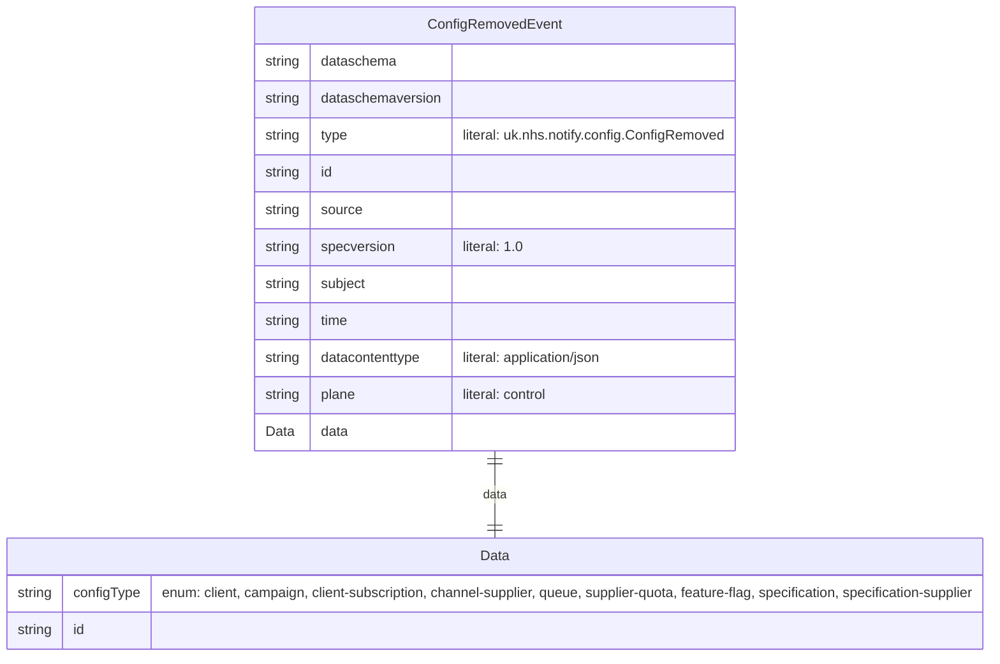

# config-removed-1.0.0 event schema

```mermaid
erDiagram
    ConfigRemovedEvent {
        string dataschema
        string dataschemaversion
        string type "literal: uk.nhs.notify.config.ConfigRemoved"
        string id
        string source
        string specversion "literal: 1.0"
        string subject
        string time
        string datacontenttype "literal: application/json"
        string plane "literal: control"
        Data data
    }
    Data {
        string configType "enum: client, campaign, client-subscription, channel-supplier, queue, supplier-quota, feature-flag, specification, specification-supplier"
        string id
    }
    ConfigRemovedEvent ||--|| Data : "data"
```
