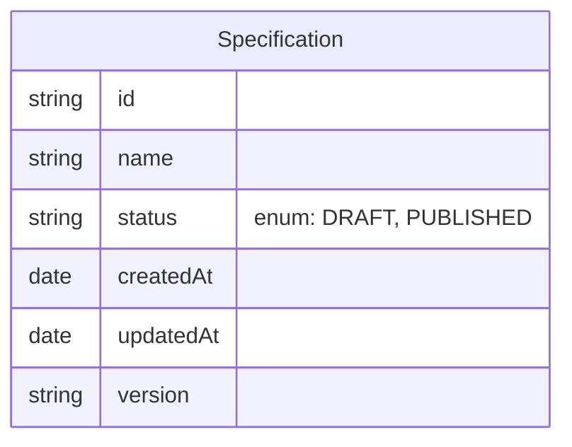

# Specification Config Domain Model Entities

```mermaid
erDiagram
    Specification {
        string id
        string name
        string status "enum: DRAFT, PUBLISHED"
        date createdAt
        date updatedAt
        string version
    }
```
